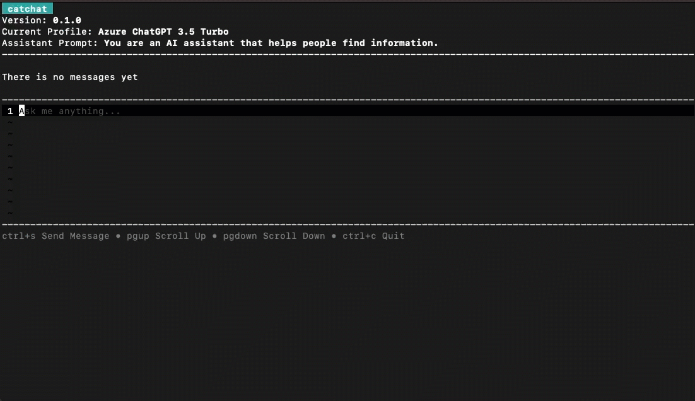
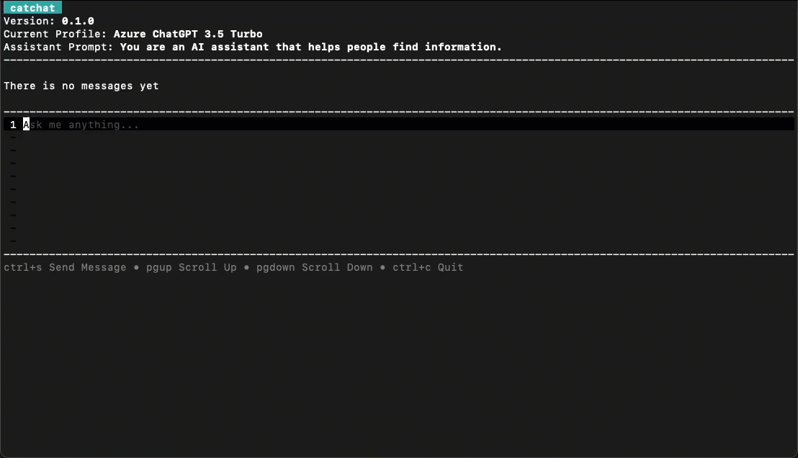
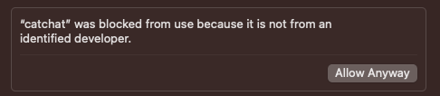

# catchat - AI chat on your terminal

## Description

`catchat` is a multi-provider profile-based AI chatting program for your terminal. 

Currently, catchat supports [OpenAI](https://openai.com/) and [Azure OpenAI](https://azure.microsoft.com/en-us/products/ai-services/openai-service) profile providers.

## Features

### Stream Message

### Markdown Rendering

### Profile Lazy Management (Create, Delete, List)

## Installation

You can download the latest version manually from [latest release](https://github.com/imkcat/catchat/releases/latest).

## Usage

1. Run `catchat` on you terminal
2. Choose profile (program will ask you to create a new profile if there is no profile yet)
3. That's it!

## FAQ

1. “catchat” can’t be opened because Apple cannot check it for malicious software.
   
   Go to `System Settings` -> `Privacy & Security` -> `Security`, click `Allow Anyway` button

   

## Contributing

If you are interested in contributing to the project, please refer to our [Contribution Guidelines](CONTRIBUTING.md) for more information.

## License

catchat is licensed under the MIT License. See the [LICENSE](LICENSE) file for details.